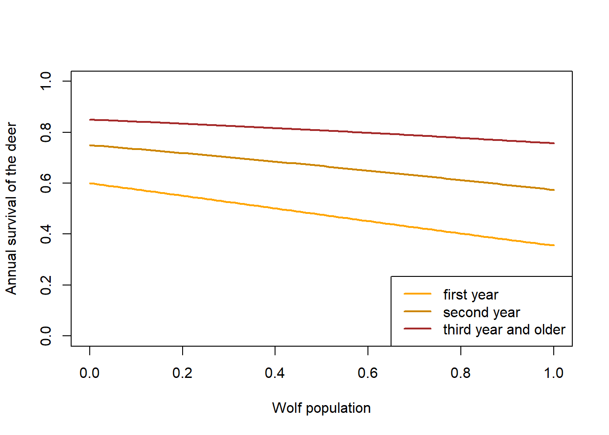
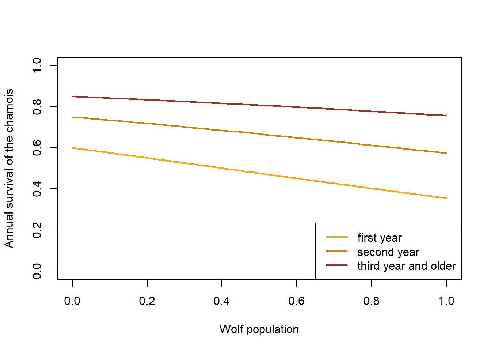
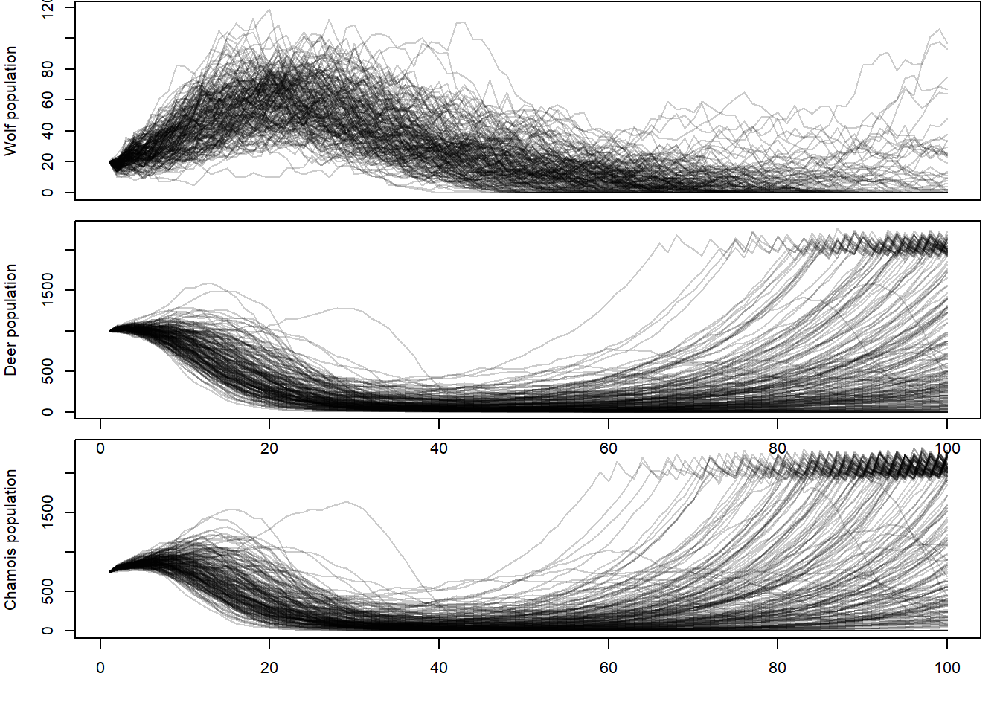

# Introduction


# Terminology

We adopt the following logic for parameter names:  
1. species   
2. area (A = In for within the park, Out for outside the park)
3. parameter name (survival, reproduction etc.)  
4. age index (1 = first year (birth to one year after birth), 2 second year,  ... , 2+ or 2plus includes the second and all following years)  
5. time (year)  


We follow the terminology given in @Thomson.2009d for survival parameters: $S$ for true survival, $\phi$ for apparent survival, i.e. the product of site fidelity and survival.


TOD: indices t für alle Parameter einfügen.

- Populationen in und out separat!

| in text           | in code        | description |
| ----------------- | -------------- |----------- |
| $^{wolfA}S_{1,t}$      | `wolfInS1`, `wolfOutS1`       | annual survival of a wolf from birth to first summer |
| $^{wolfA}S_{2,t}$      | `wolfInS2`,  `wolfOutS2`      | annual survival of a wolf from first to second summer |
| $^{wolfA}S_{3+,t}$   | `wolfInS3plus`, `wolfOutS3plus`   | annual survival of a wolf from second summer onward |
| $^{wolfA}f_t$   | `wolfInf`, `wolfOutf`   | average number of puppies produced per female in one year |
| $^{wolfA}N_{1,t}$   | `wolfInN1`,`wolfOutfN1`    | number of first year wolves just before reproduction inside or outside of the park|
| $^{wolfA}N_{2,t}$   | `wolfInN2`, `wolfOutN2`   | number of second year wolves just before reproduction inside or outside of the park|
| $^{wolfA}N_{3+,t}$   | `wolfInN3plus`, `wolfOutN3plus`   | number of older wolves just before reproduction inside or outside of the park|
| $^{wolfA}P_t$   | `wolfInP`, `wolfOutP`   | number of wolf packs inside or outside of the park|
| $^{wolfA}F_t$   | `wolfInFplus`, `wolfOutFplus`   | number of reproducing female wolves inside or outside of the park|
| $^{deerA}N_1$   | `deerInN1`, `deerOutN1`        | number of yearlings of deer inside and outside of the park |
| $^{deerA}N_2$   | `deerInN2`, `deerOutN2`        | number of second year individuals of deer inside and outside of the park |
| $^{deerA}N_3$   | `deerInN3`, `deerOutN3`        | number of third year and older individuals of deer inside and outside of the park |
| $^{deerA}S_1$   |  `deerInS1`, `deerOutS1`        | survival of a deer from birth to first summer |
| $^{deerA}S_2$   | `deerInS2`, `deerOutS2`        | survival of a deer from first to second summer |
| $^{deerA}S_{3+}$   | `deerInS3plus`, `deerOutS3plus`        | survival of a deer from second summer onward |
| $^{deerA}f$   | `deerInf`, `deerOutf`        | average number of young produced per female in one year |
| $^{chamoisA}S_1$   | `chamoisInS1`, `chamoisOutS1`        | survival of a chamois from birth to first summer |
| $^{chamoisA}S_2$   | `chamoisInS2`, `chamoisOutS2`        | survival of a chamois from first to second summer |
| $^{chamoisA}S_{3+}$   | `chamoisInS3plus`, `chamoisOutS3plus`        | survival of a chamois from second summer onward |
| $^{chamoisA}f$   | `chamoisInf`, `chamoisOutf`        | average number of young produced per female in one year |


# Functions for survival and reproduction

## Wolf

### Survival

We assume that wolf survival is higher the higher the deer population


```r
# Funktion sollte enthalten: 1. Simulation korrelierter Modellkoeffizienten, simulation verschiedener Survivalwerte
FUNwolfS1 <- function(x) plogis(-0.9 + 0.6*x)  
FUNwolfS2 <- function(x) plogis(0 + 0.6*x)
FUNwolfS3plus <- function(x) plogis(0.6 + 0.6*x)

x <- seq(0, 1, length=100)  # 0 = no ungulates, 1 =maximum number of ungulates
y1 <- FUNwolfS1(x)
y2 <- FUNwolfS2(x)
y3 <- FUNwolfS3plus(x)
  
plot(x, y1, type="l", lwd=2, col="orange", xlab="Food availability", ylab="Annual survival of the Wolf",
     ylim=c(0,1))
lines(x, y2, lwd=2, col="orange3")
lines(x, y3, lwd=2, col="brown")

legend("bottomright", lwd=2, col=c("orange", "orange3", "brown"), legend=c("first year", "second year", "third year and older"))
```


### Reproduction

We assume that a wolf litter is between 1 and 11 pups, with litters of 4-6 being most frequent. 


```r
littersize <- 1:11
problittersize0 <- c(2, 2.5, 3,6,8,6,5,4,3,2,1)
problittersize <- problittersize0/sum(problittersize0)

barplot(problittersize, names=littersize, xlab="Litter size")
```


```r
FUNwolfnpups <- function(nfemalesW){
  litters <- sample(1:11, prob=problittersize, size=nfemalesW, replace=TRUE)
  return(sum(litters))
}
```


### Carrying capacity


```r
wolfmaxN <- 30  # is used in the model to normalise the effect of wolf in the ecosystem

ungulatesmaxN <- 3000 # is used in the model to normalise the effect of ungulates on the wolf
```


## Red deer 

Hunting starts in September (whole months), if quota not fulfilled, there is another hunt in October for around 10 days. 

###survival


```r
# expected population growth rate 
S1 <- 0.6
S2 <- 0.75
S3plus <- 0.85
f <- 1.1
deerLeslie <- matrix(c(0,f/2*S1,f/2*S1,f/2*S1,
                       S1, 0,0,0,
                       0,S2,0,0,
                       0,0,S3plus,S3plus), ncol=4, nrow=4, byrow=TRUE)
max(Re(eigen(deerLeslie)$values))
```

```
## [1] 1.024414
```


We assume that prey survival is lower the higher the predator population and juvenile prey is more strongly affected by the predator compared to adults.


```r
# x = wolf population (normalised, 0-1), 
# propindiet = proportion of deer in wolf diet
FUNdeerS1 <- function(x, propindiet=1) plogis(qlogis(0.6)-1*x*propindiet)
FUNdeerS2 <- function(x, propindiet=1) plogis(qlogis(0.75)-0.8*x*propindiet)
FUNdeerS3plus <- function(x, propindiet=1) plogis(qlogis(0.85)-0.6*x*propindiet)

x <- seq(0, 1, length=100)  # 0 = no ungulates, 1 =maximum number of ungulates
y1 <- FUNdeerS1(x)
y2 <- FUNdeerS2(x) # first year survival
y3 <- FUNdeerS3plus(x)
  
plot(x, y1, type="l", lwd=2, col="orange", xlab="Wolf population", ylab="Annual survival of the deer",
     ylim=c(0,1))
lines(x, y2, lwd=2, col="orange3")
lines(x, y3, lwd=2, col="brown")

legend("bottomright", lwd=2, col=c("orange", "orange3", "brown"), legend=c("first year", "second year", "third year and older"))
```




## Red deer reproduction

We assume that a female deer has 0,1 or 2 young with probabilities 0.05, 0.85 and 0.1. 


```r
FUNdeerncalves <- function(nrfemales, npop, capacity=2000){
  nryoung <- sample(c(0,1,2), prob=c(0.05,0.85,0.1), size=nrfemales, replace=TRUE)
 if(npop>capacity) nryoung <- sample(c(0,1,2), prob=c(0.5,0.5,0), size=nrfemales, replace=TRUE)
 return(sum(nryoung))
  }
```


## Red deer proportions inside the park


```r
FUNdeerpropSuIn <- function(ndvi){
  # standardised ndvi (mean 0, sd 1)
 plogis(0.5*ndvi)
  }
FUNdeerpropHuIn <- function(){
  # standardised ndvi (mean 0, sd 1)
 plogis(0.5*ndvi)
  }
```


## Chamois

### Chamois survival

survival of chamois depends on NDVI and red deer population. Survival may be low when deer population is high and NDVI is high, survival may be high when NDVI is high and deer population is low. When NDVI is low, chamois survival may not be affected. Maybe winter survival of chamois depends on summer condition.  


```r
# x = wolf population (normalised, 0-1), 
# propindiet = proportion of chamois in wolf diet
FUNchamoisS1 <- function(x, propindiet=1) plogis(qlogis(S1)-1*x*propindiet)
FUNchamoisS2 <- function(x, propindiet=1) plogis(qlogis(S2)-0.8*x*propindiet)
FUNchamoisS3plus <- function(x, propindiet=1) plogis(qlogis(S3plus)-0.6*x*propindiet)

x <- seq(0, 1, length=100)  # 0 = no ungulates, 1 =maximum number of ungulates
y1 <- FUNchamoisS1(x)
y2 <- FUNchamoisS2(x) # first year survival
y3 <- FUNchamoisS3plus(x)
  
plot(x, y1, type="l", lwd=2, col="orange", xlab="Wolf population", ylab="Annual survival of the chamois",
     ylim=c(0,1))
lines(x, y2, lwd=2, col="orange3")
lines(x, y3, lwd=2, col="brown")

legend("bottomright", lwd=2, col=c("orange", "orange3", "brown"), legend=c("first year", "second year", "third year and older"))
```




### Chamois reproduction


```r
FUNchamoisncalves <- function(nrfemales, npop, capacity=2000){
  nryoung <- sample(c(0,1,2,3), prob=c(0.05,0.8,0.1,0.05), size=nrfemales, replace=TRUE)
  if(npop>capacity) nryoung <- sample(c(0,1,2,3), prob=c(0.5,0.5,0,0), size=nrfemales, replace=TRUE)
  return(sum(nryoung))
  }
```


## Model

We pre-breeding population models. 


```r
TT <- 100 # number of years to run the model
nsim <- 200 # number of simulations

wolfN1 <- matrix(nrow=TT, ncol=nsim)
wolfN2 <- matrix(nrow=TT, ncol=nsim)
wolfN3plus <- matrix(nrow=TT, ncol=nsim)
wolfN <- matrix(nrow=TT, ncol=nsim)
wolfP <- matrix(nrow=TT, ncol=nsim)

deerN1 <- matrix(nrow=TT, ncol=nsim)
deerN2 <- matrix(nrow=TT, ncol=nsim)
deerN3plus <- matrix(nrow=TT, ncol=nsim)
deerN <- matrix(nrow=TT, ncol=nsim)
deerpropIn <- matrix(nrow=TT, ncol=nsim)


chamoisN1 <- matrix(nrow=TT, ncol=nsim)
chamoisN2 <- matrix(nrow=TT, ncol=nsim)
chamoisN3plus <- matrix(nrow=TT, ncol=nsim)
chamoisN <- matrix(nrow=TT, ncol=nsim)


for(r in 1:nsim){
  wolfN1[1,r] <- 7
  wolfN2[1,r] <- 4
  wolfN3plus[1,r] <- 9
  wolfN[1, r] <- wolfN1[1,r] + wolfN2[1,r] +wolfN3plus[1,r]
  wolfP[1,r] <- 1
  deerN1[1,r] <- 150
  deerN2[1,r] <- 100
  deerN3plus[1,r] <- 750
  deerN[1, r] <- deerN1[1,r] + deerN2[1,r] +deerN3plus[1,r]
  chamoisN1[1,r] <- 100
  chamoisN2[1,r] <- 50
  chamoisN3plus[1,r] <- 600
  chamoisN[1, r] <- chamoisN1[1,r] + chamoisN2[1,r] +chamoisN3plus[1,r]
  
  
  for(t in 2:TT){
    
  # Wolf 
  wolfnrepfemales <- min(c(wolfN3plus[t-1,r]/2, wolfP[t-1,r]*2), na.rm=TRUE) # number of reproducing females
  wolfnpups <- FUNwolfnpups(wolfnrepfemales) 
  wolfS1 <- FUNwolfS1((deerN[t-1,r]+chamoisN[t-1,r])/ungulatesmaxN)
  wolfS2 <- FUNwolfS2((deerN[t-1,r]+chamoisN[t-1,r])/ungulatesmaxN)
  wolfS3plus <- FUNwolfS3plus((deerN[t-1,r]+chamoisN[t-1,r])/ungulatesmaxN)
  
  wolfN1[t,r] <- rbinom(1, size=wolfnpups, prob=wolfS1)
  wolfN2[t,r] <- rbinom(1, size=wolfN1[t-1,r], prob=wolfS2)
  wolfN3plus[t,r] <- rbinom(1, size=wolfN2[t-1,r]+wolfN3plus[t-1,r], prob=wolfS3plus)
  wolfN[t, r] <- wolfN1[t,r] + wolfN2[t,r] +wolfN3plus[t,r]
  
  
  # Red deer
  deernrepfemales <- round((deerN2[t-1,r]+deerN3plus[t-1,r])/2) # number of reproducing females
  deerncalves <- FUNdeerncalves(deernrepfemales, npop=deerN[t-1,r])
  propdeerindiet <- deerN[t-1,r]/(deerN[t-1,r]+chamoisN[t-1,r])
  if(is.na(propdeerindiet)) propdeerindiet <- 0
  deerS1 <- FUNdeerS1(wolfN[t-1,r]/wolfmaxN, propindiet=propdeerindiet)
  deerS2 <- FUNdeerS2(wolfN[t-1,r]/wolfmaxN, propindiet=propdeerindiet)
  deerS3plus <- FUNdeerS3plus(wolfN[t-1,r]/wolfmaxN, propindiet=propdeerindiet)
  
  deerN1[t,r] <- rbinom(1, size=deerncalves, prob=deerS1)
  deerN2[t,r] <- rbinom(1, size=deerN1[t-1,r], prob=deerS2)
  deerN3plus[t,r] <- rbinom(1, size=deerN2[t-1,r]+deerN3plus[t-1,r], prob=deerS3plus)
  deerN[t, r] <- deerN1[t,r] + deerN2[t,r] +deerN3plus[t,r]
  
  # Chamois
  chamoisnrepfemales <- round((chamoisN2[t-1,r]+chamoisN3plus[t-1,r])/2) # number of reproducing females
  chamoisncalves <- FUNchamoisncalves(chamoisnrepfemales, npop=chamoisN[t-1,r])
  propchamoisindiet <- chamoisN[t-1,r]/(deerN[t-1,r]+chamoisN[t-1,r])
  if(is.na(propchamoisindiet)) propchamoisindiet <- 0
  chamoisS1 <- FUNchamoisS1(wolfN[t-1,r]/wolfmaxN, propindiet=propchamoisindiet)
  chamoisS2 <- FUNchamoisS2(wolfN[t-1,r]/wolfmaxN, propindiet=propchamoisindiet)
  chamoisS3plus <- FUNchamoisS3plus(wolfN[t-1,r]/wolfmaxN, propindiet=propchamoisindiet)
  
  chamoisN1[t,r] <- rbinom(1, size=chamoisncalves, prob=chamoisS1)
  chamoisN2[t,r] <- rbinom(1, size=chamoisN1[t-1,r], prob=chamoisS2)
  chamoisN3plus[t,r] <- rbinom(1, size=chamoisN2[t-1,r]+chamoisN3plus[t-1,r], prob=chamoisS3plus)
  chamoisN[t, r] <- chamoisN1[t,r] + chamoisN2[t,r] +chamoisN3plus[t,r]

  } # close t
} # close r
```


```r
par(mfrow=c(3,1), mar=c(1,4,0.1,1), oma=c(3,0,0,0))
plot(1:TT, seq(0, max(wolfN), length=TT), type="n", xlab=NA, ylab="Wolf population", xaxt="n")
for(i in 1:nsim) lines(1:TT, wolfN[,i], col=rgb(0,0,0,0.2))


plot(1:TT, seq(0,max(deerN), length=TT), type="n", xlab="year", ylab="Deer population")
for(i in 1:nsim) lines(1:TT, deerN[,i], col=rgb(0,0,0,0.2), xaxt="n")


plot(1:TT, seq(0,max(chamoisN), length=TT), type="n", xlab="year", ylab="Chamois population")
for(i in 1:nsim) lines(1:TT, chamoisN[,i], col=rgb(0,0,0,0.2))
```




# References
