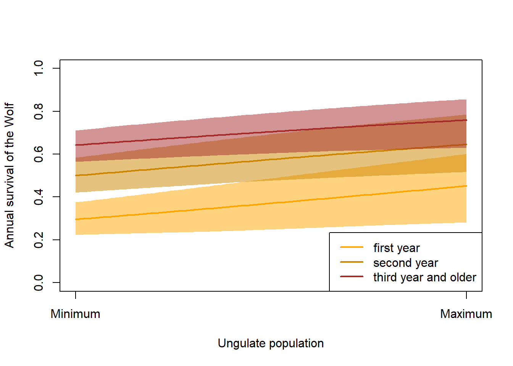
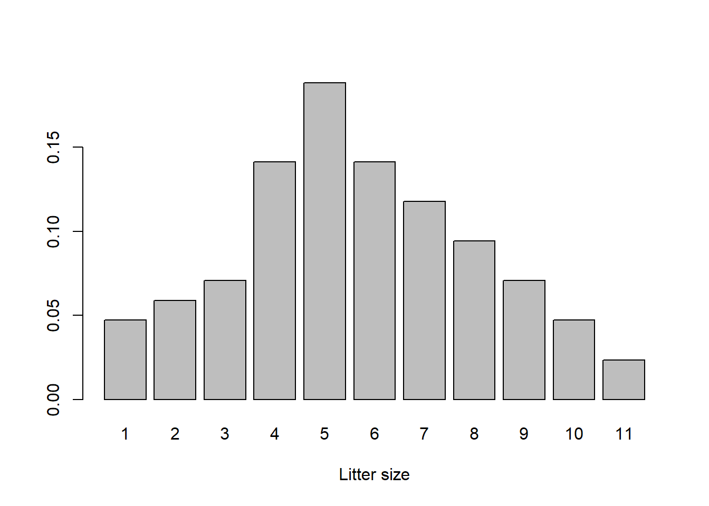
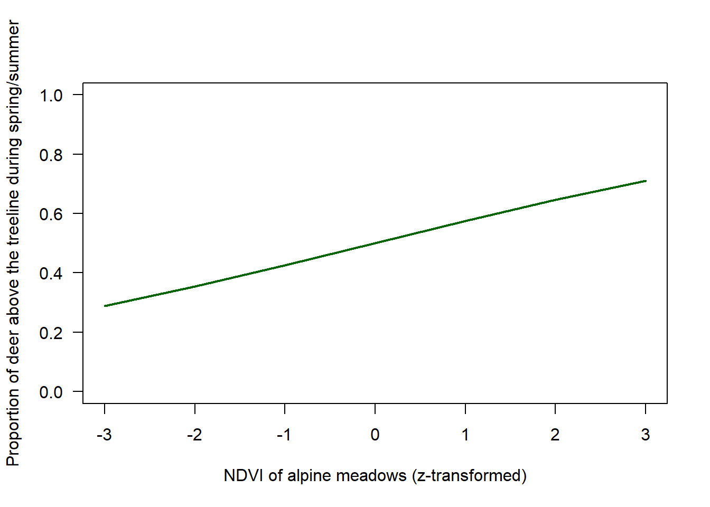
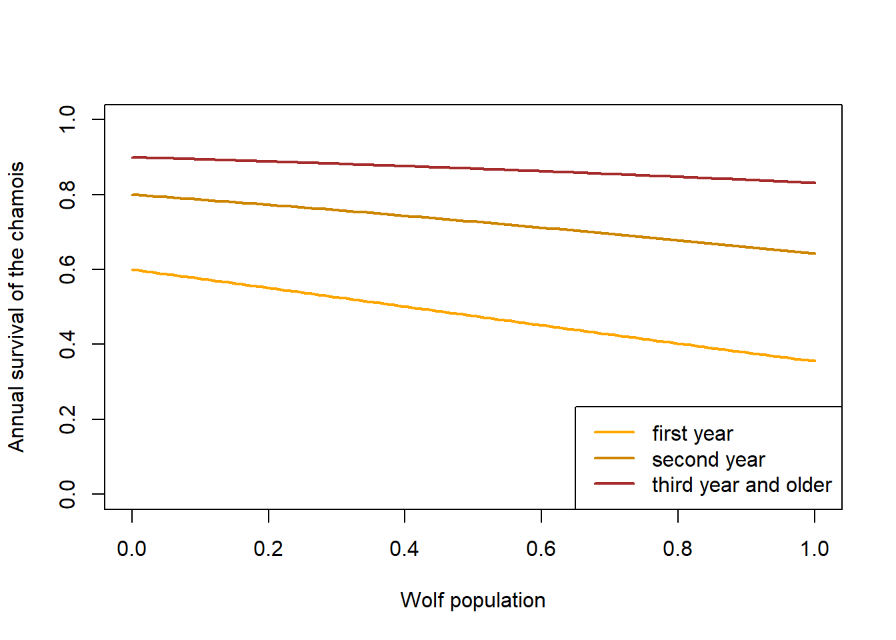

# Introduction


```r
library(MASS)
library(scales)
```

```
## Warning: Paket 'scales' wurde unter R Version 4.2.3 erstellt
```


# Terminology

We adopt the following logic for parameter names:  
1. species   
2. area (A = In for within the park, Out for outside the park)
3. parameter name (survival, reproduction etc.)  
4. age index (0 = juvenile (birth to one year after birth), 1 = first year (to second year),  2 = second year (to third year), ... , 3+ or 3plus includes the third and all following years  
5. time (year)  


We follow the terminology given in @Thomson.2009d for survival parameters: $S$ for true survival, $\phi$ for apparent survival, i.e. the product of site fidelity and survival.

TODO: include ranges of values used 


| in text           | in code        | description |
| ----------------- | -------------- |----------- |
| $^{wolf}S_{0,t}$      | `wolfS0``       | annual survival of a wolf from birth to first summer |
| $^{wolf}S_{1,t}$      | `wolfS1`      | annual survival of a wolf from first to second summer |
| $^{wolf}S_{2+,t}$   | `wolfS2plus`   | annual survival of a wolf from second summer onward |
| $^{wolf}f_t$   | `wolff`   | average number of puppies produced per female in one year |
| $^{wolf}N_{0,t}$   | `wolfN0`    | number of puppies|
| $^{wolf}N_{1,t}$   | `wolfN1`    | number of first year wolves at reproduction|
| $^{wolf}N_{2,t}$   | `wolfN2`   | number of second year wolves at reproduction|
| $^{wolf}N_{3+,t}$   | `wolfN3plus`   | number of older wolves at reproduction |
| $^{wolf}P_t$   | `wolfP``   | number of wolf packs inside or outside of the park|
| $^{wolf}F_t$   | `wolfFplus`   | number of reproducing female wolves per pack|
| $^{deerA}N_{1,t}$   | `deerInN1`, `deerOutN1`        | number of yearlings of deer inside and outside of the park |
| $^{deerA}N_{2,t}$   | `deerInN2`, `deerOutN2`        | number of second year individuals of deer inside and outside of the park |
| $^{deerA}N_{3,t}$   | `deerInN3`, `deerOutN3`        | number of third year and older individuals of deer inside and outside of the park |
| $^{deerA}S_{1,t}$   |  `deerInS1`, `deerOutS1`        | survival of a deer from birth to first summer |
| $^{deerA}S_{2,t}$   | `deerInS2`, `deerOutS2`        | survival of a deer from first to second summer |
| $^{deerA}S_{3+,t}$   | `deerInS3plus`, `deerOutS3plus`        | survival of a deer from second summer onward |
| $^{deerA}f_{t}$   | `deerInf`, `deerOutf`        | average number of young produced per female in one year |
| $^{chamoisA}S_{1,t}$   | `chamoisInS1`, `chamoisOutS1`        | survival of a chamois from birth to first summer |
| $^{chamoisA}S_{2,t}$   | `chamoisInS2`, `chamoisOutS2`        | survival of a chamois from first to second summer |
| $^{chamoisA}S_{3+,t}$   | `chamoisInS3plus`, `chamoisOutS3plus`        | survival of a chamois from second summer onward |
| $^{chamoisA}f_{t}$   | `chamoisInf`, `chamoisOutf`        | average number of young produced per female in one year |


```r
TT <- 100 # number of years to run the model
nsim <- 50 # number of Monte Carlo iterations
```


# Environmental variables

## NDVI of alpine meadows 

*todo: match z-value to a real value, include effects of grazers on the NDVI*


```r
envNDVI <- rnorm(TT)
```


# Functions for the demographic parameters

## Wolf

### Survival

We assume that wolf survival is higher the higher the ungulate populations


```r
FUNwolfS1 <- function(x, sdInt=0.2, sdslope=0.2, corpars=0.8){
  # x = normalised ungulate density (0 = minimal, 1 = maximal)
  # corpars = correlation between intercept and slope
  Sigma <- matrix(c(sdInt^2, sdInt*sdslope*corpars, sdInt*sdslope*corpars, sdslope^2), nrow=2)
  pars <- mvrnorm(n = 1, mu = c(-0.9,0.6), Sigma = Sigma)
  plogis(pars[1] + pars[2]*x)  
}

FUNwolfS2 <- function(x, sdInt=0.2, sdslope=0.2, corpars=0.8){
  Sigma <- matrix(c(sdInt^2, sdInt*sdslope*corpars, sdInt*sdslope*corpars, sdslope^2), nrow=2)
  pars <- mvrnorm(n = 1, mu = c(0,0.6), Sigma = Sigma)
  plogis(pars[1] + pars[2]*x)
}

FUNwolfS3plus <- function(x, sdInt=0.2, sdslope=0.2, corpars=0.8){ 
  Sigma <- matrix(c(sdInt^2, sdInt*sdslope*corpars, sdInt*sdslope*corpars, sdslope^2), nrow=2)
  pars <- mvrnorm(n = 1, mu = c(0.6,0.6), Sigma = Sigma)
    plogis(pars[1] + pars[2]*x)
}

x <- seq(0, 1, length=100)  # 0 = no ungulates, 1 =maximum number of ungulates
y1 <- matrix(NA, ncol=nsim, nrow=length(x))
y2 <- matrix(NA, ncol=nsim, nrow=length(x))
y3 <- matrix(NA, ncol=nsim, nrow=length(x))
for(i in 1:nsim){
  y1[,i] <- FUNwolfS1(x)
  y2[,i] <- FUNwolfS2(x)
  y3[,i] <- FUNwolfS3plus(x)
}

y1mean <- apply(y1, 1, mean)
y1lwr <- apply(y1, 1, quantile, probs=0.025)
y1upr <- apply(y1, 1, quantile, probs=0.975)


y2mean <- apply(y2, 1, mean)
y2lwr <- apply(y2, 1, quantile, probs=0.025)
y2upr <- apply(y2, 1, quantile, probs=0.975)

y3mean <- apply(y3, 1, mean)
y3lwr <- apply(y3, 1, quantile, probs=0.025)
y3upr <- apply(y3, 1, quantile, probs=0.975)

plot(x, y1[,1], type="n", lwd=2, col="orange", xlab="Ungulate population", ylab="Annual survival of the Wolf", ylim=c(0,1), xaxt="n")
axis(1, at=c(0,1), labels=c("Minimum", "Maximum"))
polygon(c(x, rev(x)), c(y1lwr, rev(y1upr)), border=NA, col=alpha("orange", 0.5))
lines(x, y1mean, col="orange", lwd=2)
polygon(c(x, rev(x)), c(y2lwr, rev(y2upr)), border=NA, col=alpha("orange3", 0.5))
lines(x, y2mean, col="orange3", lwd=2)
polygon(c(x, rev(x)), c(y3lwr, rev(y3upr)), border=NA, col=alpha("brown", 0.5))
lines(x, y3mean, col="brown", lwd=2)

legend("bottomright", lwd=2, col=c("orange", "orange3", "brown"), legend=c("first year", "second year", "third year and older"))
```




### Reproduction

We assume that a wolf litter is between 1 and 11 pups, with litters of 4-6 being most frequent. 


```r
littersize <- 1:11
problittersize0 <- c(2, 2.5, 3,6,8,6,5,4,3,2,1)
problittersize <- problittersize0/sum(problittersize0)

barplot(problittersize, names=littersize, xlab="Litter size")
```



```r
FUNwolfnpups <- function(nfemalesW){
  litters <- sample(1:11, prob=problittersize, size=nfemalesW, replace=TRUE)
  return(sum(litters))
}
```


### Carrying capacity


```r
wolfmaxN <- 30  # is used in the model to normalise the effect of wolf in the ecosystem

ungulatesmaxN <- 10000 # is used in the model to normalise the effect of ungulates on the wolf
```


## Red deer 


### Deer movements

A proportion of deer moves into the park during hunting and also depending on the grass biomass above the treeline, a proportion of deer moves above the treeline where the deer can interact with Chamois. 

We assign a deer to belong to inside or outside the park according to where it is during reproduction. The location of deer can change seasonally during hunting.  

Hunting starts in September (whole months), if quota not fulfilled, there is another hunt in October for around 10 days. During the hunting period, a certain proportion of deer from outside the park move temporary into the park where they are protected. 


```r
# proportion of deer that are above the treeline during summer 
# the number of deeer above the treeline is competing with chamois
FUNdeerpropSuhigh <- function(ndvi){
  # standardised ndvi (mean 0, sd 1)
 return(plogis(0.3*ndvi))
}


FUNdeerpropHuIn <- function(){
  # we assume that 20% of the outside population move into the park during hunting
 return(0.2)
}

x <- seq(-3,3)
plot(x, FUNdeerpropSuhigh(x), type="l", lwd=2, col="darkgreen", ylim=c(0,1), 
     xlab="NDVI of alpine meadows (z-transformed)", las=1, ylab="Proportion of deer above the treeline during spring/summer")
```


  


### Red deer survival

Males live up to 17 years, females up to 20 years [@schweizerische_gesellschaft_fur_wildtierbiologie_sgw_atlas_2021].  
*todo: separate population models for males and females*


```r
# expected population growth rate; trying out demographic parameters that produce plausible growth 
S1 <- 0.6
S2 <- 0.75
S3plus <- 0.85
f <- 1.1
deerLeslie <- matrix(c(0,f/2*S2,f/2*S3plus,f/2*S3plus,
                       S1, 0,0,0,
                       0,S2,0,0,
                       0,0,S3plus,S3plus), ncol=4, nrow=4, byrow=TRUE)
max(Re(eigen(deerLeslie)$values))
```

```
## [1] 1.079313
```


We assume that deer survival is lower the higher the wolf population and juveniles are more strongly affected by the wolf compared to adults. Further, the effect of the wolf is larger the larger the proportion of deer in the diet of the wolf. 


```r
# x = wolf population (normalised, 0-1), 
# propindiet = proportion of deer in wolf diet
FUNdeerInS1 <- function(x, propindiet=1) plogis(qlogis(0.6)-1*x*propindiet)
FUNdeerInS2 <- function(x, propindiet=1) plogis(qlogis(0.75)-0.8*x*propindiet)
FUNdeerInS3plus <- function(x, propindiet=1) plogis(qlogis(0.85)-0.6*x*propindiet)

FUNdeerOutS1 <- function(x, propindiet=1) plogis(qlogis(0.6)-1*x*propindiet)
FUNdeerOutS2 <- function(x, propindiet=1) plogis(qlogis(0.75)-0.8*x*propindiet)
FUNdeerOutS3plus <- function(x, propindiet=1) plogis(qlogis(0.85)-0.6*x*propindiet)

x <- seq(0, 1, length=100)  # 0 = no ungulates, 1 =maximum number of ungulates
y1 <- FUNdeerInS1(x)
y2 <- FUNdeerInS2(x) # first year survival
y3 <- FUNdeerInS3plus(x)
  
par(mfrow=c(1,2))
plot(x, y1, type="l", lwd=2, col="orange", xlab="Wolf population", ylab="Annual survival of the deer",
     ylim=c(0,1), main="Inside the park")
lines(x, y2, lwd=2, col="orange3")
lines(x, y3, lwd=2, col="brown")

legend("bottomright", lwd=2, col=c("orange", "orange3", "brown"), legend=c("first year", "second year", "third year and older"))

y1 <- FUNdeerOutS1(x)
y2 <- FUNdeerOutS2(x) # first year survival
y3 <- FUNdeerOutS3plus(x)

plot(x, y1, type="l", lwd=2, col="orange", xlab="Wolf population", ylab="Annual survival of the deer",
     ylim=c(0,1), main="Outside the park (without hunting)")
lines(x, y2, lwd=2, col="orange3")
lines(x, y3, lwd=2, col="brown")
```


### Red deer reproduction

We assume that a female deer has 0,1 or 2 young with probabilities 0.05, 0.85 and 0.1. 


```r
FUNdeerncalves <- function(nrfemales, npop, capacity=2000){
  nryoung <- sample(c(0,1,2), prob=c(0.05,0.85,0.1), size=nrfemales, replace=TRUE)
 if(npop>capacity) nryoung <- sample(c(0,1,2), prob=c(0.5,0.5,0), size=nrfemales, replace=TRUE)
 return(sum(nryoung))
  }
```


## Chamois

### Chamois survival

lifespan is upt to 21 or 22 years for males and females respectively [@schweizerische_gesellschaft_fur_wildtierbiologie_sgw_atlas_2021].  

survival of chamois depends on NDVI and red deer population. Survival may be low when deer population is high and NDVI is high, survival may be high when NDVI is high and deer population is low. When NDVI is low, chamois survival may not be affected. Maybe winter survival of chamois depends on summer condition.  


```r
# expected population growth rate; trying out demographic parameters that produce plausible growth 
S1 <- 0.6 # survival from 0 to 1
S2 <- 0.8 # survival from 1 to 2
S3plus <- s3plus <- 0.9 #survival from 2 year onward 
f <- 0.9
deerLeslie <- matrix(c(0,f/2*S2,f/2*S3plus,f/2*S3plus,
                       S1, 0,0,0,
                       0,S2,0,0,
                       0,0,S3plus,S3plus), ncol=4, nrow=4, byrow=TRUE)
max(Re(eigen(deerLeslie)$values))
```

```
## [1] 1.096916
```


```r
# x = wolf population (normalised, 0-1), 
# propindiet = proportion of chamois in wolf diet
FUNchamoisS1 <- function(x, propindiet=1) plogis(qlogis(S1)-1*x*propindiet)
FUNchamoisS2 <- function(x, propindiet=1) plogis(qlogis(S2)-0.8*x*propindiet)
FUNchamoisS3plus <- function(x, propindiet=1) plogis(qlogis(S3plus)-0.6*x*propindiet)

x <- seq(0, 1, length=100)  # 0 = no ungulates, 1 =maximum number of ungulates
y1 <- FUNchamoisS1(x)
y2 <- FUNchamoisS2(x) # first year survival
y3 <- FUNchamoisS3plus(x)
  
plot(x, y1, type="l", lwd=2, col="orange", xlab="Wolf population", ylab="Annual survival of the chamois",
     ylim=c(0,1))
lines(x, y2, lwd=2, col="orange3")
lines(x, y3, lwd=2, col="brown")

legend("bottomright", lwd=2, col=c("orange", "orange3", "brown"), legend=c("first year", "second year", "third year and older"))
```




### Chamois reproduction


```r
FUNchamoisncalves <- function(nrfemales, npop, capacity=2000){
  nryoung <- sample(c(0,1,2,3), prob=c(0.05,0.8,0.1,0.05), size=nrfemales, replace=TRUE)
  if(npop>capacity) nryoung <- sample(c(0,1,2,3), prob=c(0.5,0.5,0,0), size=nrfemales, replace=TRUE)
  return(sum(nryoung))
  }
```


# Multi-species model

## Model runs

We build pre-breeding population models. 
-> better use a post-breeding population model because ungulate count include juveniles. 


```r
wolfN1 <- matrix(nrow=TT, ncol=nsim)
wolfN2 <- matrix(nrow=TT, ncol=nsim)
wolfN3plus <- matrix(nrow=TT, ncol=nsim)
wolfN <- matrix(nrow=TT, ncol=nsim)
wolfP <- matrix(nrow=TT, ncol=nsim)

deerInN1 <- matrix(nrow=TT, ncol=nsim)
deerInN2 <- matrix(nrow=TT, ncol=nsim)
deerInN3plus <- matrix(nrow=TT, ncol=nsim)
deerOutN1 <- matrix(nrow=TT, ncol=nsim)
deerOutN2 <- matrix(nrow=TT, ncol=nsim)
deerOutN3plus <- matrix(nrow=TT, ncol=nsim)
deerInN <- matrix(nrow=TT, ncol=nsim)
deerOutN <- matrix(nrow=TT, ncol=nsim)
deerN <- matrix(nrow=TT, ncol=nsim)
deerpropIn <- matrix(nrow=TT, ncol=nsim) # proportion of deer from outside that move into the SNP during hunting


chamoisInN1 <- matrix(nrow=TT, ncol=nsim)
chamoisInN2 <- matrix(nrow=TT, ncol=nsim)
chamoisInN3plus <- matrix(nrow=TT, ncol=nsim)
chamoisInN <- matrix(nrow=TT, ncol=nsim)
chamoisOutN1 <- matrix(nrow=TT, ncol=nsim)
chamoisOutN2 <- matrix(nrow=TT, ncol=nsim)
chamoisOutN3plus <- matrix(nrow=TT, ncol=nsim)
chamoisOutN <- matrix(nrow=TT, ncol=nsim)
chamoisN <- matrix(nrow=TT, ncol=nsim)


for(r in 1:nsim){
# starting populations
  wolfN1[1,r] <- 7
  wolfN2[1,r] <- 4
  wolfN3plus[1,r] <- 9
  wolfN[1, r] <- wolfN1[1,r] + wolfN2[1,r] +wolfN3plus[1,r]
  wolfP[1,r] <- 1
  deerInN1[1,r] <- 300
  deerInN2[1,r] <- 150
  deerInN3plus[1,r] <- 1000
  deerInN[1, r] <- deerInN1[1,r] + deerInN2[1,r] +deerInN3plus[1,r]
  
  deerOutN1[1,r] <- 500
  deerOutN2[1,r] <- 250
  deerOutN3plus[1,r] <- 1500
  deerOutN[1, r] <- deerOutN1[1,r] + deerOutN2[1,r] +deerOutN3plus[1,r]
  deerN[1,r] <- deerInN[1,r] + deerOutN[1,r]
  
  chamoisInN1[1,r] <- 100
  chamoisInN2[1,r] <- 50
  chamoisInN3plus[1,r] <- 600
  chamoisInN[1, r] <- chamoisInN1[1,r] + chamoisInN2[1,r] +chamoisInN3plus[1,r]
  chamoisOutN1[1,r] <- 400
  chamoisOutN2[1,r] <- 200
  chamoisOutN3plus[1,r] <- 2400
  chamoisOutN[1, r] <- chamoisOutN1[1,r] + chamoisOutN2[1,r] +chamoisOutN3plus[1,r]
  chamoisN[1, r] <- chamoisInN[1,r] + chamoisOutN[1,r]
  
  
  for(t in 2:TT){
    
  # Wolf 
  wolfnrepfemales <- min(c(wolfN3plus[t-1,r]/2, wolfP[t-1,r]*2), na.rm=TRUE) # number of reproducing females
  wolfnpups <- FUNwolfnpups(wolfnrepfemales) 
  wolfS1 <- FUNwolfS1((deerN[t-1,r]+chamoisN[t-1,r])/ungulatesmaxN)
  wolfS2 <- FUNwolfS2((deerN[t-1,r]+chamoisN[t-1,r])/ungulatesmaxN)
  wolfS3plus <- FUNwolfS3plus((deerN[t-1,r]+chamoisN[t-1,r])/ungulatesmaxN)
  
  wolfN1[t,r] <- rbinom(1, size=wolfnpups, prob=wolfS1)
  wolfN2[t,r] <- rbinom(1, size=wolfN1[t-1,r], prob=wolfS2)
  wolfN3plus[t,r] <- rbinom(1, size=wolfN2[t-1,r]+wolfN3plus[t-1,r], prob=wolfS3plus)
  wolfN[t, r] <- wolfN1[t,r] + wolfN2[t,r] +wolfN3plus[t,r]
  
  
  # Red deer
  deerInnrepfemales <- round((deerInN2[t-1,r]+deerInN3plus[t-1,r])/2) # number of reproducing females
  deerOutnrepfemales <- round((deerOutN2[t-1,r]+deerOutN3plus[t-1,r])/2) # number of reproducing females
  deerInncalves <- FUNdeerncalves(deerInnrepfemales, npop=deerInN[t-1,r], capacity=2000)
  deerOutncalves <- FUNdeerncalves(deerOutnrepfemales, npop=deerOutN[t-1,r], capacity=2000)
  
  propdeerInindiet <- deerInN[t-1,r]/(deerInN[t-1,r]+chamoisInN[t-1,r])
  if(is.na(propdeerInindiet)) propdeerInindiet <- 0
  propdeerOutindiet <- deerOutN[t-1,r]/(deerOutN[t-1,r]+chamoisOutN[t-1,r])
  if(is.na(propdeerOutindiet)) propdeerOutindiet <- 0
  
  deerInS1 <- FUNdeerInS1(wolfN[t-1,r]/wolfmaxN, propindiet=propdeerInindiet)
  deerInS2 <- FUNdeerInS2(wolfN[t-1,r]/wolfmaxN, propindiet=propdeerInindiet)
  deerInS3plus <- FUNdeerInS3plus(wolfN[t-1,r]/wolfmaxN, propindiet=propdeerInindiet)
  
  deerOutS1 <- FUNdeerInS1(wolfN[t-1,r]/wolfmaxN, propindiet=propdeerOutindiet)
  deerOutS2 <- FUNdeerInS2(wolfN[t-1,r]/wolfmaxN, propindiet=propdeerOutindiet)
  deerOutS3plus <- FUNdeerInS3plus(wolfN[t-1,r]/wolfmaxN, propindiet=propdeerOutindiet)
  
  
  deerInN1[t,r] <- rbinom(1, size=deerInncalves, prob=deerInS1)
  deerInN2[t,r] <- rbinom(1, size=deerInN1[t-1,r], prob=deerInS2)
  deerInN3plus[t,r] <- rbinom(1, size=deerInN2[t-1,r]+deerInN3plus[t-1,r], prob=deerInS3plus)
  deerInN[t, r] <- deerInN1[t,r] + deerInN2[t,r] +deerInN3plus[t,r]

  deerOutN1[t,r] <- rbinom(1, size=deerOutncalves, prob=deerOutS1)
  deerOutN2[t,r] <- rbinom(1, size=deerOutN1[t-1,r], prob=deerOutS2)
  deerOutN3plus[t,r] <- rbinom(1, size=deerOutN2[t-1,r]+deerOutN3plus[t-1,r], prob=deerOutS3plus)
  deerOutN[t, r] <- deerOutN1[t,r] + deerOutN2[t,r] +deerOutN3plus[t,r]
  deerN[t, r] <- deerInN[t,r] + deerOutN[t,r]
    
  # Chamois
  chamoisInnrepfemales <- round((chamoisInN2[t-1,r]+chamoisInN3plus[t-1,r])/2) # number of reproducing females
  chamoisInncalves <- FUNchamoisncalves(chamoisInnrepfemales, npop=chamoisInN[t-1,r], capacity=2000)
  chamoisOutnrepfemales <- round((chamoisOutN2[t-1,r]+chamoisOutN3plus[t-1,r])/2) # number of reproducing females
  chamoisOutncalves <- FUNchamoisncalves(chamoisOutnrepfemales, npop=chamoisOutN[t-1,r], capacity=8000)
  
  propchamoisInindiet <- chamoisInN[t-1,r]/(deerInN[t-1,r]+chamoisInN[t-1,r])
  if(is.na(propchamoisInindiet)) propchamoisInindiet <- 0
  propchamoisOutindiet <- chamoisOutN[t-1,r]/(deerOutN[t-1,r]+chamoisOutN[t-1,r])
  if(is.na(propchamoisOutindiet)) propchamoisOutindiet <- 0

  chamoisInS1 <- FUNchamoisS1(wolfN[t-1,r]/wolfmaxN, propindiet=propchamoisInindiet)
  chamoisInS2 <- FUNchamoisS2(wolfN[t-1,r]/wolfmaxN, propindiet=propchamoisInindiet)
  chamoisInS3plus <- FUNchamoisS3plus(wolfN[t-1,r]/wolfmaxN, propindiet=propchamoisInindiet)

  chamoisOutS1 <- FUNchamoisS1(wolfN[t-1,r]/wolfmaxN, propindiet=propchamoisOutindiet)
  chamoisOutS2 <- FUNchamoisS2(wolfN[t-1,r]/wolfmaxN, propindiet=propchamoisOutindiet)
  chamoisOutS3plus <- FUNchamoisS3plus(wolfN[t-1,r]/wolfmaxN, propindiet=propchamoisOutindiet)
  
  chamoisInN1[t,r] <- rbinom(1, size=chamoisInncalves, prob=chamoisInS1)
  chamoisInN2[t,r] <- rbinom(1, size=chamoisInN1[t-1,r], prob=chamoisInS2)
  chamoisInN3plus[t,r] <- rbinom(1, size=chamoisInN2[t-1,r]+chamoisInN3plus[t-1,r], prob=chamoisInS3plus)
  chamoisInN[t, r] <- chamoisInN1[t,r] + chamoisInN2[t,r] +chamoisInN3plus[t,r]
  
  chamoisOutN1[t,r] <- rbinom(1, size=chamoisOutncalves, prob=chamoisOutS1)
  chamoisOutN2[t,r] <- rbinom(1, size=chamoisOutN1[t-1,r], prob=chamoisOutS2)
  chamoisOutN3plus[t,r] <- rbinom(1, size=chamoisOutN2[t-1,r]+chamoisOutN3plus[t-1,r], prob=chamoisOutS3plus)
  chamoisOutN[t, r] <- chamoisInN1[t,r] + chamoisOutN2[t,r] +chamoisOutN3plus[t,r]
  chamoisN[t, r] <- chamoisInN[t,r] + chamoisOutN[t,r]
  } # close t
} # close r
```


## Results

ATTENTION: This model is under construction, thus the results here show how a possible outcome could look like. However, the parameters used to simulate the model are not yet worked out properly. Therefore, be aware: unreliable input gives unreliable output. 


```r
par(mfrow=c(7,1), mar=c(1,4,0.1,1), oma=c(3,2,0,0))
plot(1:TT, seq(0, max(wolfN), length=TT), type="n", xlab=NA, ylab=NA, xaxt="n")
for(i in 1:nsim) lines(1:TT, wolfN[,i], col=rgb(0,0,0,0.2))
text(1,max(wolfN), adj=c(0,1) , labels="Wolf region")
mtext("Population size",side=2, line=0, outer=TRUE)


plot(1:TT, seq(0,max(deerN), length=TT), type="n", xlab="year", ylab="", xaxt="n")
for(i in 1:nsim) lines(1:TT, deerN[,i], col=rgb(0,0,0,0.2), xaxt="n")
text(1,max(deerN), adj=c(0,1) , labels="Red deer region")

plot(1:TT, seq(0,max(deerInN), length=TT), type="n", xlab="year", ylab="", xaxt="n")
for(i in 1:nsim) lines(1:TT, deerInN[,i], col=rgb(0,1,0,0.2), xaxt="n")
text(1,max(deerInN), adj=c(0,1) , labels="Red deer in park")


plot(1:TT, seq(0,max(deerOutN), length=TT), type="n", xlab="year", ylab="", xaxt="n")
for(i in 1:nsim) lines(1:TT, deerOutN[,i], col=rgb(0,0,1,0.2), xaxt="n")
text(1,max(deerOutN), adj=c(0,1) , labels="Red deer outside park")


plot(1:TT, seq(0,max(chamoisN), length=TT), type="n", xlab="year", ylab="", xaxt="n")
for(i in 1:nsim) lines(1:TT, chamoisN[,i], col=rgb(0,0,0,0.2))
text(1,max(chamoisN), adj=c(0,1) , labels="Chamois region")


plot(1:TT, seq(0,max(chamoisInN), length=TT), type="n", xlab="year", ylab="", xaxt="n")
for(i in 1:nsim) lines(1:TT, chamoisInN[,i], col=rgb(0,1,0,0.2))
text(1,max(chamoisInN), adj=c(0,1) , labels="Chamois in park")

plot(1:TT, seq(0,max(chamoisOutN), length=TT), type="n", xlab="year", ylab="")
for(i in 1:nsim) lines(1:TT, chamoisOutN[,i], col=rgb(0,0,1,0.2))
text(1,max(chamoisOutN), adj=c(0,1) , labels="Chamois outside park")
```


# References
