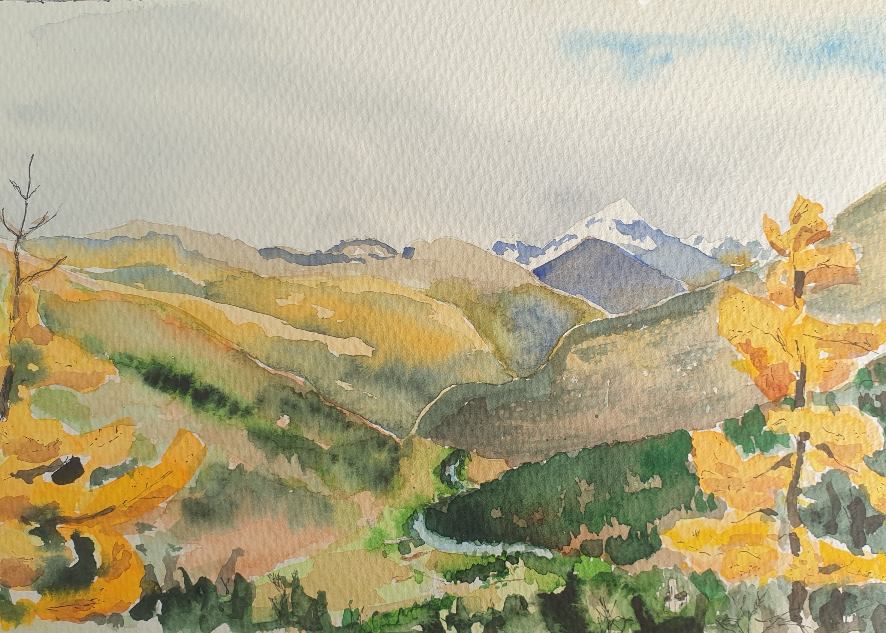

--- 
title: "Development version of a multi-species population model for the SNP-region"
author: "Fränzi Korner-Nievergelt"
date: "2025-08-21"
site: bookdown::bookdown_site
documentclass: book
bibliography: [PopModAlpineSpec.bib]
link-citations: yes
github-repo: fraenzi/multi-species_model_SNP-region
cover-image: figures/titlepicture.jpg
description: "The multi-species model aims at representing mathematically the ecosystem in the SNP-region."
code_folding: hide

---

# Preface

The development of this model should serve to predict consequences of different managements or global changes on the ecosystem in the SNP-region.

## Acknowledgments {-}

